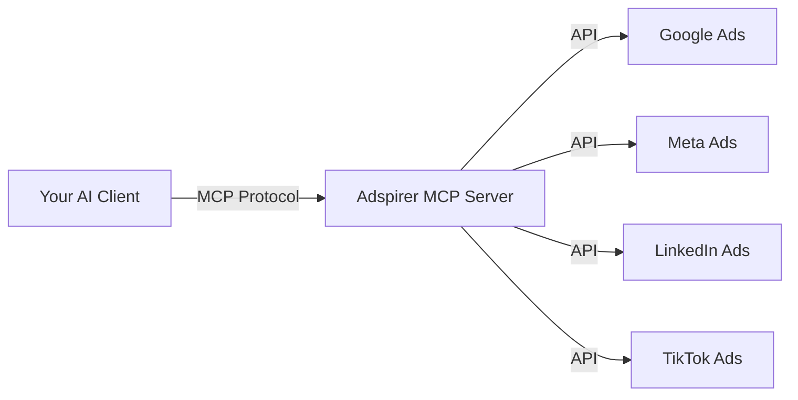

# How MCP Works

The **Model Context Protocol (MCP)** is an open standard that lets AI assistants connect to external tools and data sources. Think of it as a universal adapter between AI and the real world.

## The Problem MCP Solves

Without MCP, managing ads with AI requires:
- Copy-pasting data between dashboards and chat windows
- Building custom API integrations for each AI tool
- No real-time data — AI works with stale information

With MCP, your AI assistant has **direct, secure access** to your ad platforms in real-time.

## How Adspirer Uses MCP

1. **Your AI client** (Claude, ChatGPT, Cursor, etc.) connects to the Adspirer MCP server
2. **The MCP server** authenticates you via OAuth 2.1 and exposes 100+ tools
3. **When you ask** your AI to do something (e.g., "create a campaign"), the AI calls the appropriate MCP tool
4. **The tool executes** the action on the ad platform API and returns the result
5. **Your AI formats** the response and shows you the outcome

## Key Concepts

### Tools
Discrete actions the AI can take — like `create_search_campaign`, `get_campaign_performance`, or `research_keywords`. Adspirer provides 100+ tools across 4 platforms.

### Resources
Data the AI can read — like your business profile or strategy document. These provide context so the AI makes better decisions.

### Prompts
Pre-built conversation starters that guide the AI through complex workflows like campaign creation or performance review.

### Skills
Higher-level capabilities that combine multiple tools into cohesive workflows. For example, the "Campaign Management" skill chains keyword research → campaign creation → ad copy → extensions into a single guided process.

## Security Model

- **OAuth 2.1 with PKCE** — Industry-standard authentication
- **HTTPS/TLS** — All data encrypted in transit
- **No data logging** — Conversations and ad data are not stored by the MCP server
- **Scoped access** — You control which ad accounts are accessible
- **Read-safe defaults** — Destructive actions require explicit confirmation

<Card title="Learn more about security" icon="shield" href="https://www.adspirer.com/docs/knowledge-base/security">
  Read our full security documentation
</Card>
